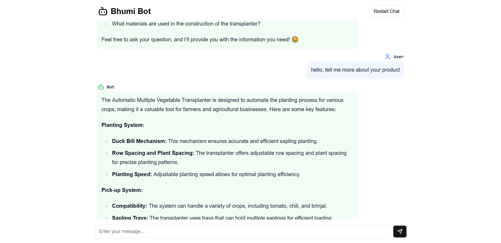
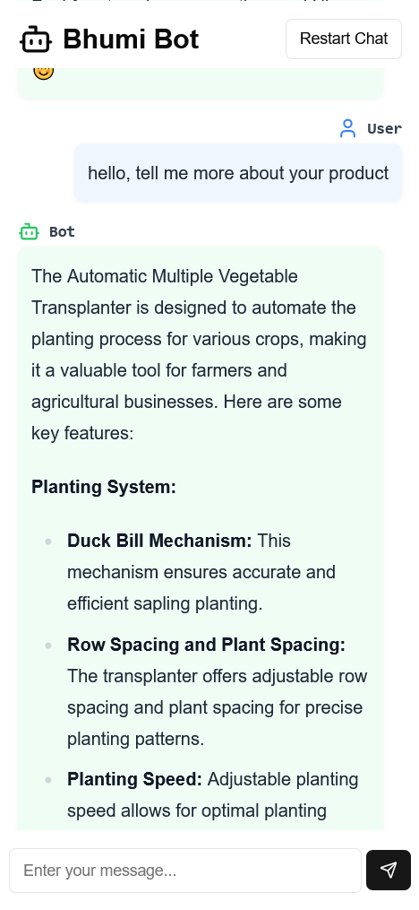
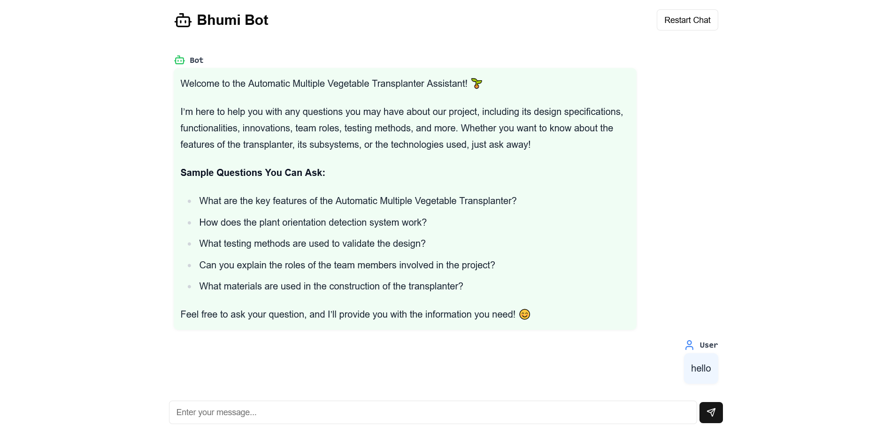
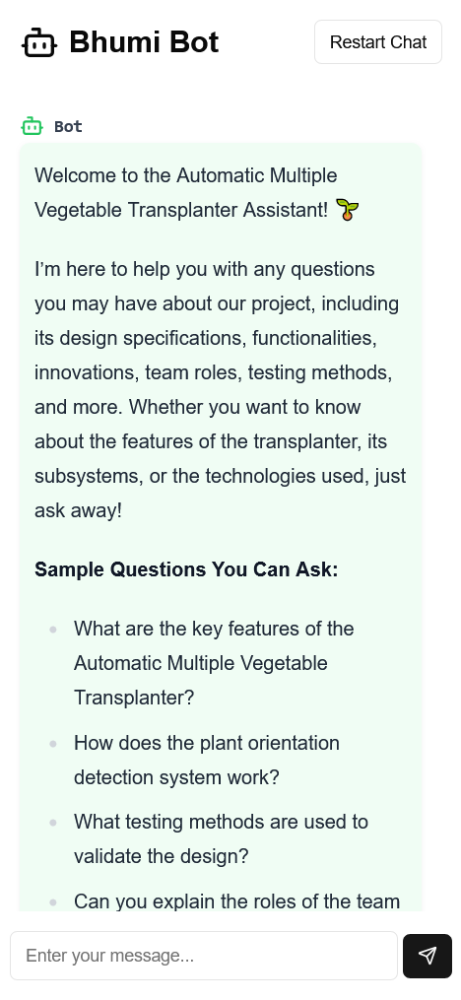

# 🤖 Intelligent Chatbot Powered by Generative AI

This intelligent chatbot was developed in just **1 day** for the **Bhumiputra team** from **DIEMS, Chhatrapati Sambhajinagar** to compete in the **TIFAN competition**! 🌟 Powered by **Google Gemini AI**, the chatbot provides advanced conversational capabilities within a secure, private environment. 

## 🚀 Project Overview

- **Generative AI-Powered**: Uses Google Gemini to enable intelligent and responsive conversations. 💬
- **Built with Next.js**: Utilizes server-side functions for optimized performance, crafted as a Next.js application. ⚙️
- **Privacy-First Design**: User privacy is a priority, and no data is stored, allowing for secure and confidential interactions. 🔒
- **Tailwind CSS Styling**: Styled with Tailwind CSS, delivering a modern and adaptive user interface. 🎨

## 🖼️ Screenshots
| Desktop View | Mobile View |
|--------------|-------------|
|  |  |
|  |  |

## 📦 Dev

To start the development server, run:
```bash
npm run dev
# or
yarn dev
```

Open [http://localhost:3000](http://localhost:3000) in your browser to see the project in action! 🎉
